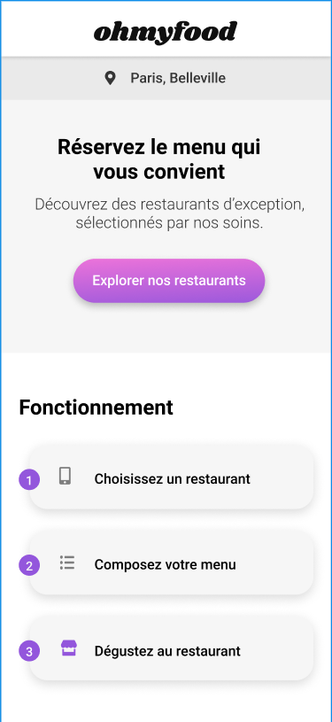

# OhMyFood 

Projet 4 du parcours "Intégrateur Web" chez OpenClassrooms. 
L'objectif est de développer le site OhMyFood en "Mobile First" et de le dynamiser avec des animations CSS en utilisant le préprocesseur Sass.

# Mission :

## Objectifs
- 1. Développer un site proposant le menu de 4 grands restaurants parisiens.
- 2. Permettre la réservation en ligne et la composition de menus.

## Développer le site en "mobile first" selon la maquette
**Composition :** 
- **Une page d'accueil**
- **Quatre pages comtenant le menu d'un restaurant**

## Compatibilités du site
- ** Mobile **
- ** Tablette **
- ** Ordinateur **

## Technologies 
** Recommandées :** HTML / CSS / Sass
** Interdits :** JavaScript

Vous pouvez retrouver le [brief complet ici](https://github.com/Matthieu83600/OhMyFood/blob/main/ressources/Brief%2Bcr%C3%A9atif%2Bsite%2BOhmyfood.pdf)